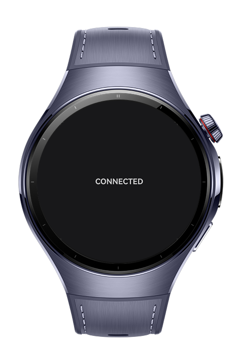

> **Note:** To access all shared projects, get information about environment setup, and view other guides, please visit [Explore-In-HMOS-Wearable Index](https://github.com/Explore-In-HMOS-Wearable/hmos-index).

# How to Check Network Connection

This app checks whether your device is connected to the internet or not.

# Preview

<div>
    
    
</div>

# Tech Stack

- **Languages**: ArkTS, Typescript
- **Frameworks**: HarmonyOS SDK 5.0.21(18)
- **Tools**: DevEco Studio Vers 5.1.0.852
- 
## Directory Structure
```
├───entryability
│       EntryAbility.ets
│
├───entrybackupability
│       EntryBackupAbility.ets
│
└───pages
Index.ets
NetworkConnectionService.ets

```

# Constraints and Restrictions

## Supported Devices

- Huawei Watch 5

# LICENSE

CheckNetworkConnection is distributed under the terms of the MIT License.
See the [LICENSE](/LICENSE) for more information.